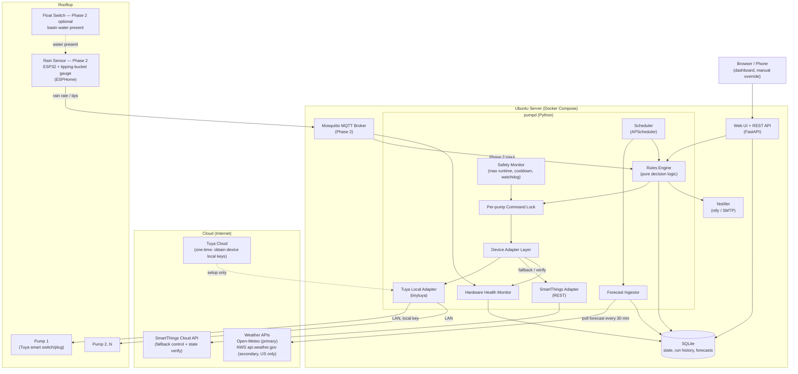

# Rooftop Rain Pump Automation — System Architecture

**Version:** 1.1.0

## 1. Overview

A local controller service running on an Ubuntu server automates rooftop drain pumps that are currently switched manually through SmartThings and Smart Life. The service polls a weather forecast, decides when pumps should run, and switches them — preferring **local LAN control** (Tuya local protocol) with the **SmartThings cloud API as fallback**. Phase 2 adds a physical rain sensor over MQTT for precise, forecast-independent triggering.

For operational caveats and deployment limitations, see [design-caveats.md](design-caveats.md).

## 2. System Architecture Diagram



## 3. Functional Description

### Forecast Ingestor

Polls Open-Meteo (free, no API key) every `poll_minutes` (default **30**) for hourly precipitation probability and expected rainfall (mm) at the building's coordinates. Open-Meteo fields: `precipitation_probability`, `rain` (mm per hour).

NWS is a **secondary, US-only** source for cross-checking. It requires a two-step lookup (`/points/{lat},{lon}` → gridpoint hourly forecast). NWS is **skipped automatically** when `location` is outside the US bounding box. Provider responses are normalized to a common `HourlyForecast` shape before storage.

When providers disagree, the rules engine uses the **more conservative** reading for start decisions (higher probability, higher amount) and records both sources in the event log. Provider health (last success, last error, staleness) is stored and shown on the dashboard; a failed secondary provider does not block the primary.

During internet outages, the engine continues evaluating using the **most recent cached forecast** plus MQTT/manual inputs. Cached data older than `watchdog_stale_forecast_hours` triggers the stale-forecast watchdog (see Safety).

### Rules Engine

Runs on a schedule (default every 10 min) and on manual-override events. Core logic is implemented as **pure functions** with explicit inputs and outputs (see §6).

**Pre-emptive start:** within the next `lookahead_hours`, if **any single hour** has precipitation probability ≥ `precip_probability_threshold` **and** the **sum of hourly rain (mm)** over the lookahead window ≥ `precip_amount_threshold_mm` → transition enabled pumps in `auto` mode to `pre_rain` / running.

**Continue (rain active):** while the rain signal reports `is_raining=true`, keep pumps running. When `duty_cycle.enabled=true`, apply on/off cycling **only during pre_rain and running phases** — not during post_rain_drain.

**Post-rain drain:** after the rain signal clears (`is_raining=false`), run pumps **continuously** (duty cycle disabled) for `post_rain_drain_minutes`, then stop.

**Stop:** rain signal inactive and post-rain drain complete → pumps off (subject to cooldown).

**Phase 2 — MQTT rain sensor:**

When MQTT is enabled and `confidence ≥ mqtt.min_confidence`, the sensor is **authoritative for `is_raining`** — it overrides the forecast in **both directions**:

- Sensor reports rain while forecast says dry → treat as raining (can start pumps from `idle`).
- Sensor reports dry while forecast says rain → treat as not raining.

Forecast still drives **pre-emptive starts** when the sensor is dry or unavailable (confidence below threshold).

If the sensor reports dry for `sensor_dry_minutes` while pumps are running, stop early (including during `post_rain_drain` unless the float switch says water is present).

**Phase 2 — float switch:**

- `water_present=true` → force run regardless of forecast or sensor.
- `water_present=false` for `sensor_dry_minutes` → allow early stop even during `post_rain_drain` or while forecast/sensor still indicate rain.

**Per-pump behavior:** rain decisions apply to all pumps with `enabled=true`. Each pump maintains its own mode, runtime counters, cooldown, and phase state. One pump failing control does not stop others.

### Decision Priority Ladder

Highest priority wins. Numbering is unchanged from v1.0; v1.1 clarifies the manual/safety interaction.

1. **Safety hard-stops** — max continuous runtime, cooldown after safety trip, stale-forecast watchdog (see exceptions below), engine-evaluation watchdog
2. **Manual mode** — `manual_on` / `manual_off` (auto-reverts to `auto` after `manual_revert_hours`)
3. **Phase 2 float switch** — `water_present=true` → run; dry for `sensor_dry_minutes` → allow stop
4. **Phase 2 MQTT sensor** — authoritative `is_raining` when confident; early stop after `sensor_dry_minutes` dry
5. **Forecast rules** — pre-emptive start, continue, post-rain drain
6. **Default** — off

**Manual mode vs safety:**

- Manual mode can override safety hard-stops **only** when `approve_safety_override=true` is sent on the mode-change API (`POST /api/pumps/{name}/mode`). The override is **logged** and **notified**.
- **Without** approval, safety hard-stops beat manual mode — e.g. stale-forecast watchdog or max-runtime cutoff will force pumps off even in `manual_on`.
- Cooldown after a safety trip does not block entering `manual_on`, but max-runtime still applies once the pump is running unless safety override is approved.

**Watchdog vs sensor exception:** when MQTT is enabled and the sensor reports `is_raining=true` with `confidence ≥ mqtt.min_confidence`, pumps **remain running** even if forecasts are stale. A notification is still sent. If the sensor is disabled, stale, or low-confidence, the stale-forecast watchdog turns pumps off.

### Pump Phase State Machine (per pump, `auto` mode)

```
idle ──(pre-emptive start)──► pre_rain ──(rain active)──► running
  ▲                              │                            │
  │                              │                            │
  │         (rain ends)          ▼                            ▼
  └────(drain complete)──── post_rain_drain ◄──(rain ends)────┘
```

- `manual_on` / `manual_off` bypass the state machine until revert (subject to safety rules above).
- MQTT sensor reporting rain can transition pumps from `idle` directly to `running`.
- Safety max-runtime forces off → `idle` with cooldown lock.
- Duty-cycle on/off alternates within `pre_rain` and `running` only.

### Device Adapter Layer

Abstracts pump control behind a single interface (`turn_on / turn_off / get_state`). Primary path is **tinytuya** over the LAN (requires one-time local-key extraction via the Tuya IoT platform). Fallback path is the **SmartThings REST API** when local control fails after 3 retries.

**Verification:** after every command, read state back via the **same adapter that succeeded**. If verification fails, retry once via the alternate adapter. Log and notify on persistent mismatch or total failure. Control and verify outcomes feed the hardware health monitor (§13). Tuya local-key rotation (re-pairing) surfaces as a control failure alert.

### Safety Monitor

Enforces per-pump invariants regardless of rules (unless manual safety override is approved):

- **Max continuous runtime** — force off when exceeded; enter cooldown.
- **Cooldown** — after any safety-forced stop, block automated restarts for `min_cooldown_minutes`. Does **not** block `manual_on` entry (but max-runtime still applies once running unless override approved).
- **Stale-forecast watchdog** — if no fresh forecast within `watchdog_stale_forecast_hours`, turn pumps off and alert (unless MQTT sensor exception above applies).
- **Engine-evaluation watchdog** — if no rules evaluation within `2 × evaluate_minutes`, turn pumps off and alert. Tracked via `engine_last_eval_at` in DB.

All decisions and commands are written to the `events` table.

### Web UI / REST API

FastAPI serves a Jinja2 dashboard with optional htmx partial refresh (`GET /partials/status` every 30 s). REST endpoints support curl and Home Assistant integration.

Optional **API key auth** (`api.auth_enabled`, header `X-API-Key`) protects the dashboard, htmx partials, and `POST /api/pumps/{name}/mode` when enabled. When disabled (default for trusted LAN), those endpoints are open. **`GET /health` is always unauthenticated** so Docker and external monitors work even if API keys are misconfigured.

Per-pump command serialization uses an asyncio lock with `api.lock_timeout_seconds` (default 30). Lock acquisition failure returns HTTP **409**.

### Notifier

Pushes events (pumps started/stopped, control failure, watchdog trip, safety override, provider errors, hardware faults) via ntfy and/or SMTP.

### Phase 2 — Rain Sensor

An ESP32 running ESPHome with a tipping-bucket rain gauge publishes rain tips/rate to Mosquitto. Optional float switches per basin publish `water_present`. The rules engine subscribes via `mqtt_signal.py`. No cloud involved.

## 4. Components

### Software (all on the Ubuntu server, Docker Compose)

| Component | Technology | Role |
| :---- | :---- | :---- |
| pumpd | Python 3.12, FastAPI, APScheduler, tinytuya, httpx, paho-mqtt | Forecast polling, rules engine, device control, safety |
| Web UI / API | FastAPI + Uvicorn, Jinja2 (+ htmx partials) | Dashboard, manual override, REST API |
| Database | SQLite (SQLAlchemy 2.x) | Config state, run history, forecast cache, event log, hardware health |
| MQTT broker | Eclipse Mosquitto (container, commented out until Phase 2) | Rain sensor ingestion |
| Notifications | ntfy and/or SMTP | Alerts and status pushes |
| Weather sources | Open-Meteo (primary), NWS (secondary, US only) | Hourly precipitation forecast |
| Setup tooling | tinytuya wizard + Tuya IoT platform account | One-time local-key extraction |
| Deployment | Docker Compose + systemd (`compose up` on boot) | Reliability, restarts, logs |

### Hardware

| Item | Notes |
| :---- | :---- |
| Existing Tuya/Smart Life smart switches or plugs driving the pumps | Reused as-is; controlled locally via LAN. Fixed IPs (DHCP reservations). |
| Ubuntu server | Always-on mini PC, NUC, or Pi 4/5. Wired Ethernet recommended. |
| **Phase 2:** ESP32 dev board (e.g., ESP32-WROOM) | Runs ESPHome; Wi-Fi to LAN, publishes to MQTT. |
| **Phase 2:** Tipping-bucket rain gauge (e.g., Misol WH-SP-RG) | Reed-switch pulse → ESP32 GPIO; actual rain rate. |
| **Phase 2 (optional):** Float/level switch in each collection basin | Wired to ESP32; best dry-run protection. |
| Optional: weatherproof enclosure, 5 V supply for ESP32 | Rooftop mounting. |

## 5. Key Design Decisions

- **Local-first control:** tinytuya keeps pump switching on the LAN during internet outages. SmartThings cloud is fallback only.
- **Forecast now, sensor later:** abstract `RainSignal` input; Phase 2 is a config change plus `mqtt_signal.py`.
- **Fail-safe defaults:** on uncertainty (no data, control failure), pumps default off with an alert; max-runtime caps prevent dry running.
- **Conservative multi-provider:** when Open-Meteo and NWS disagree, prefer the reading that would start sooner / run longer.
- **Per-pump command lock:** asyncio lock per pump serializes scheduler, safety, and API commands to prevent races; configurable timeout returns 409.
- **Explicit safety override:** manual operators must opt in to bypass safety hard-stops; every override is audited.
- **SQLite over Postgres:** single-host, low write volume; zero admin. Schema migrations via Alembic.

## 6. Rules Engine Contract

Pure-function interface (all I/O mocked in tests):

```python
@dataclass(frozen=True)
class RainState:
    is_raining: bool
    rate_mm_h: float
    confidence: float  # 0.0–1.0
    source: Literal["forecast", "mqtt"]
    ts: datetime
    water_present: bool | None = None  # Phase 2 float switch

@dataclass
class PumpPhase:
    name: str
    enabled: bool
    phase: Literal["idle", "pre_rain", "running", "post_rain_drain"]
    mode: Literal["auto", "manual_on", "manual_off"]
    device_on: bool
    duty_on: bool                          # current duty-cycle position
    runtime_continuous_min: int
    cooldown_until: datetime | None
    manual_revert_at: datetime | None
    post_rain_drain_started_at: datetime | None
    sensor_dry_since: datetime | None
    duty_cycle_started_at: datetime | None
    safety_tripped: bool
    safety_override_approved: bool

@dataclass(frozen=True)
class SafetyFlags:
    stale_forecast: bool = False
    engine_watchdog: bool = False
    mqtt_stale_override: bool = False     # sensor rain keeps pumps on despite stale forecast

def evaluate(
    *,
    now: datetime,
    rain: RainState,
    forecast_window: list[HourlyForecast],
    pumps: list[PumpPhase],
    rules: RulesConfig,
    safety: SafetyFlags,
    max_runtime_minutes: int,
    min_cooldown_minutes: int = 15,
    mqtt_min_confidence: float = 0.8,
) -> EvaluateResult:  # commands + updated pump phases
    ...
```

**Forecast-derived `is_raining` (when MQTT disabled or below confidence):** true if any hour in the current + next 1 h has probability ≥ threshold **or** derived rate ≥ 0.1 mm/h from forecast rain amounts.

**MQTT authoritative `is_raining`:** when `rain.source == "mqtt"` and `rain.confidence >= mqtt_min_confidence`, use `rain.is_raining` directly — no blending with forecast for current conditions.

## 7. Database Schema (SQLite)

| Table | Key columns | Purpose |
| :---- | :---- | :---- |
| `forecasts` | `provider`, `hour_ts`, `pop_pct`, `rain_mm`, `fetched_at` | Hourly forecast cache |
| `provider_health` | `provider`, `last_ok_at`, `last_error`, `last_error_at` | Provider status |
| `pump_state` | `name`, `phase`, `mode`, `device_on`, `duty_on`, `runtime_continuous_min`, `cooldown_until`, `manual_revert_at`, `post_rain_drain_started_at`, `sensor_dry_since`, `duty_cycle_started_at`, `safety_tripped`, `safety_override_approved`, `runtime_today_min`, `updated_at` | Current pump state |
| `events` | `id`, `ts`, `pump_name`, `event_type`, `reason`, `details_json` | Audit log |
| `engine_meta` | `key`, `value` | `engine_last_eval_at`, etc. |
| `hardware_health` | `component_id`, `component_type`, `status`, `last_ok_at`, `last_error`, `last_error_at`, `consecutive_failures`, `details_json` | Pump and sensor health |

`component_type` is `"pump"` or `"sensor"`. `status` is `"ok"`, `"degraded"`, or `"fault"`.

"Runtime today" uses the configured `timezone` (calendar day boundary).

## 8. REST API

| Method | Path | Auth | Description |
| :---- | :---- | :---- | :---- |
| GET | `/` | required if auth on | Dashboard (Jinja2) |
| GET | `/partials/status` | required if auth on | htmx partial: pump cards + rain signal + hardware health |
| GET | `/api/status` | optional | JSON: pumps, rain signal, forecast 12 h, provider health, hardware health |
| POST | `/api/pumps/{name}/mode` | required if auth on | Body: `{"mode": "auto"\|"manual_on"\|"manual_off", "approve_safety_override": false}` |
| GET | `/api/events` | optional | Query: `limit` (default 50, max 500), `pump`, `since` |
| GET | `/api/hardware-health` | optional | JSON: all hardware health rows |
| GET | `/health` | **none (always)** | See §9 |

Errors: `401` invalid API key; `404` unknown pump; `409` command lock timeout; `422` validation.

## 9. Health Endpoint

`GET /health` returns `200` when all checks pass, `503` otherwise. **Never requires authentication.**

```json
{
  "status": "ok",
  "checks": {
    "db": "ok",
    "scheduler": "ok",
    "last_forecast_age_minutes": 12,
    "last_eval_age_minutes": 3,
    "engine_watchdog": "ok",
    "hardware_faults": 0
  }
}
```

- `scheduler`: APScheduler running and jobs registered.
- `last_forecast_age_minutes`: age of newest forecast row (fail if > `poll_minutes × 2`).
- `last_eval_age_minutes`: age of `engine_last_eval_at` (fail if > `2 × evaluate_minutes`).
- `hardware_faults`: count of `hardware_health` rows with `status == "fault"`; any fault degrades overall health.
- Docker `HEALTHCHECK` should call this endpoint.

## 10. Configuration Reference

See `config.example.yaml` in the repository. Key fields in v1.1:

- `timezone` — IANA name for "runtime today" and hour boundaries (default `America/New_York`)
- `weather.poll_minutes` — forecast poll interval (default **30**)
- `manual_revert_hours` — manual override auto-revert (default 4)
- `sensor_dry_minutes` — Phase 2 early-stop delay (default 10)
- `mqtt.min_confidence` — minimum sensor confidence for authoritative `is_raining` and stale-forecast exception
- `api.auth_enabled` / `api.api_key` — optional auth for dashboard, partials, and mode changes
- `api.lock_timeout_seconds` — per-pump command lock timeout before HTTP 409 (default 30)
- `hardware_monitor` — see below
- `logging.json` — structured JSON logs
- `notifications.smtp` — email alerts
- Per-pump `enabled` flag
- `.env` overrides: `SMARTTHINGS_PAT`, `TUYA_LOCAL_KEY_{PUMP_NAME}`, `API_KEY`, `SMTP_PASSWORD`

### hardware_monitor

```yaml
hardware_monitor:
  enabled: true
  sensor_stale_minutes: 15       # no MQTT message → sensor fault
  pump_failure_threshold: 3      # consecutive control failures → fault
  verify_mismatch_threshold: 2   # consecutive verify mismatches → fault
```

When disabled, health rows are not updated but existing data remains in DB.

## 11. Startup and Shutdown

### Startup reconciliation

On startup, pumpd performs these steps in order:

1. **Read device state** — query each pump via the composite adapter (`get_state`).
2. **Device wins for `device_on`** — if physical on/off disagrees with DB, update `pump_state.device_on` to match the device and log a `reconcile` event.
3. **Restore modes and phases from DB** — `mode`, `phase`, cooldown, manual revert timestamps, and other pump_state columns are not overwritten by the device read (except `device_on`).
4. **Sync hardware to DB intent** — if the pump is **not** in `manual_on` and DB intent was off (`device_on=false` before reconcile) but the device is physically on, command off and update DB.

After reconciliation, the forecast poll job runs (or runs on its normal schedule).

### Shutdown (SIGTERM)

Stop scheduler; command all pumps off except those in `manual_on`. In-progress post-rain drain is **aborted** on shutdown (logged). Flush DB and disconnect MQTT.

## 12. Hardware Health Monitoring

The hardware health monitor tracks pumps and sensors independently of the rules engine.

**Pumps** (one row per configured pump, `component_type="pump"`):

- Records success after verified control operations (`last_ok_at`, reset failure count).
- Increments `consecutive_failures` on control errors or verify mismatches.
- Transitions to `degraded` after first failure; `fault` after `pump_failure_threshold` consecutive failures or `verify_mismatch_threshold` consecutive verify mismatches.
- Fault status is surfaced on the dashboard, `/api/hardware-health`, and contributes to `/health` degradation.

**Sensors** (row `component_id="mqtt_sensor"`, `component_type="sensor"`):

- Updated on each valid MQTT message with latest rain/float readings in `details_json`.
- Marked `fault` when no messages received within `sensor_stale_minutes` or confidence is zero.
- Stale sensor data does not satisfy the stale-forecast watchdog exception (requires live `is_raining=true` with sufficient confidence).

Alerts are sent via the notifier when components transition to `fault`.

## 13. Testing

All I/O is mocked in unit tests. See [cursor-prompt.md](cursor-prompt.md) for the implementation spec.

### Rules engine unit tests

| Scenario | What is verified |
| :---- | :---- |
| Pre-emptive start | Requires any single hour pop ≥ threshold **and** sum of rain mm in lookahead ≥ threshold |
| Pre-emptive start triggers pump | Enabled `auto` pump transitions from `idle` |
| Post-rain drain | Runs continuously for configured minutes after rain clears |
| Post-rain drain completes | Returns to `idle` after drain window |
| Duty cycle | Applies only in `pre_rain` / `running`; **not** during `post_rain_drain` |
| Sensor overrides forecast (rain) | MQTT rain while forecast dry → running |
| MQTT dry overrides forecast rain | MQTT dry while forecast rain → not raining |
| MQTT starts from idle | Authoritative sensor rain starts pump from `idle` |
| Sensor dry early stop | Dry for `sensor_dry_minutes` stops pump, including during `post_rain_drain` |
| Float dry early stop | `water_present=false` for `sensor_dry_minutes` stops during post-rain drain |
| Stale-forecast watchdog | Forces off when forecast stale |
| Watchdog + MQTT exception | Stale forecast + confident sensor rain → keeps running |
| Max runtime cutoff | Forces off and cooldown when continuous runtime exceeded |
| Cooldown blocks auto start | Pump in cooldown does not auto-start |
| Manual on / off | Overrides automation decisions |
| Manual without safety approval | Stale-forecast watchdog beats `manual_on` |
| Manual with safety override | `safety_override_approved=true` bypasses stale-forecast watchdog |
| Manual revert | Reverts to `auto` after `manual_revert_hours` |
| Multi-pump independent | Pumps evaluate independently |
| Forecast is_raining | Current-hour pop / derived rate logic |
| Provider disagreement | Conservative blend for start decisions (integration with forecast ingestor) |

### Integration tests

- **Composite adapter:** Tuya retry ×3, fallback to SmartThings, post-command verify, alternate-adapter retry on verify failure (mocked devices).

### Quality bar

- Type hints throughout; mypy and ruff clean.
- Structured logging (JSON when `logging.json=true`) with decision reasons (e.g. `"started north_pump: 82% prob, 4.1mm sum in 2h"`).
- Docker: `HEALTHCHECK` calling `/health`; restart policy; SQLite on a named volume.

## 14. Design Gaps and Known Limitations

See also [design-caveats.md](design-caveats.md) for operational guidance.

| Gap | Impact | Mitigation / future work |
| :---- | :---- | :---- |
| **Runtime tracking accuracy** | `runtime_continuous_min` resets on off transitions; `runtime_today_min` depends on evaluation cadence, not sub-minute precision | Sufficient for safety caps; not suitable for billing or fine-grained analytics |
| **Mechanical pump failure** | Switch can report ON while motor is seized or impeller is blocked | Periodic manual inspection; future flow/pressure sensor |
| **Forecast spatial mismatch** | Grid-based forecast may not match rooftop microclimate | Phase 2 MQTT sensor; tune thresholds conservatively |
| **Single-host SQLite** | No multi-instance deployment without external locking | By design for one controller per site |
| **Tuya local key rotation** | Re-pairing invalidates local keys until wizard re-run | Monitor hardware health; document re-pair procedure |
| **SmartThings WAN dependency** | Fallback useless during internet outage | Prefer Tuya local; fixed LAN IPs |
| **Duty cycle tuning** | Off windows during heavy rain may leave standing water | Tune `on_minutes` / `off_minutes` per roof |
| **No flow-based run verification** | Cannot confirm water is actually moving | Accept as Phase 1/2 limitation |
| **Safety override scope** | Override applies to hard-stops, not mechanical failure | Operator responsibility when approving override |

## 15. Changelog

### v1.1.0

- Defined rules engine contract with full `PumpPhase` fields and `RainState.source` limited to `"forecast" \| "mqtt"`.
- Clarified decision priority ladder: safety beats manual unless `approve_safety_override=true` on mode API.
- MQTT sensor authoritative for `is_raining` (both directions); starts pumps from idle; forecast still drives pre-emptive starts.
- Float switch: `water_present=true` forces run; dry grace stops even during post-rain drain.
- Added `hardware_health` table and hardware health monitoring section.
- Added `GET /api/hardware-health`; `/health` always unauthenticated; 409 on lock timeout.
- Expanded `pump_state` columns for phase tracking and safety override state.
- Documented startup reconciliation (four-step sequence).
- Forecast poll default 30 minutes (diagram and config).
- Added `api.lock_timeout_seconds` and `hardware_monitor` config sections.
- Expanded testing matrix; reference to design-caveats.md and design gaps section.
